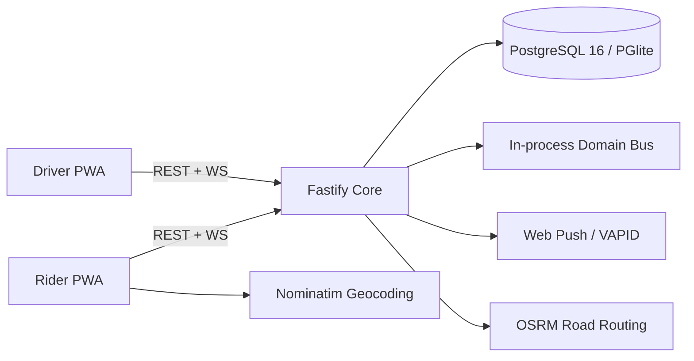

# Chalo-X Architecture

**Status:** Implemented mobile-first pilot architecture  
**Primary clients:** Rider mobile web/PWA and Driver mobile web/PWA  
**Deferred:** Native wrappers and full admin console

---

## 1. Product Boundaries

Chalo-X is a two-sided ride marketplace in which:

1. A rider chooses pickup, drop-off, and vehicle class.
2. The rider independently proposes:
   - driver take-home;
   - platform contribution;
   - resulting net total.
3. Nearby approved drivers receive the driver take-home amount.
4. A driver accepts, counters the driver amount, or skips.
5. The rider accepts, declines, or submits a final split.
6. Agreement creates one immutable trip fare snapshot.
7. OTP gates trip start; completion creates atomic ledger entries.

The current web clients are designed mobile-first and can later be wrapped using Capacitor or replaced by React Native while keeping the same protocol and API contracts.

---

## 2. Monorepo Layout

```text
apps/
  rider-web/         React/Vite rider PWA (:5173)
  driver-web/        React/Vite driver PWA (:5174)
services/
  core/              Fastify REST + WebSocket core (:8080)
packages/
  protocol/          Shared money types, FSMs, HTTP and WS contracts
```

Turborepo coordinates typecheck, build, test, and persistent development tasks. pnpm workspaces provide one dependency graph and source-level protocol sharing.

---

## 3. Runtime Topology



### Development

- PGlite persists locally in `services/core/.chalo-data`.
- Driver presence, dispatch locks, and domain events are process-local.
- No Docker is required.

### Production cutover

- `DATABASE_URL` switches storage to PostgreSQL 16.
- Redis must replace process-local presence, rate limits, and claims before multiple core replicas.
- Kafka/Redpanda must replace the process-local bus when durable cross-service delivery is required.
- Stable VAPID credentials must be configured.
- Public Nominatim and OSRM endpoints must be replaced with hosted instances or contracted providers at meaningful traffic.

---

## 4. Mobile-First Client Architecture

### Rider application

The rider app uses a map-first shell with a bottom-sheet workflow:

```text
Home/Search → Vehicle Quotes → Split Fare Builder → Matching/Counter
→ Driver Assigned/OTP → In Ride/Safety → Receipt/Rating
```

Mobile rules:

- Primary controls remain within thumb reach.
- Pickup/drop search overlays always layer above destination controls.
- Bottom navigation exposes Ride, Trips, Safety, and Account.
- Search, saved places, recents, share-trip, and emergency actions are real user flows—not decorative placeholders.
- Desktop expands the same sheet into a left-side panel; no separate desktop product logic.

### Driver application

```text
Register/Login → Fixed Vehicle Profile → Go Online → Offer Card
→ Pickup Navigation → Arrive/OTP → Trip → Completion/Earnings
```

A driver owns exactly one immutable vehicle class per account in the pilot. Vehicle changes require a future document-review workflow; the online console cannot switch classes.

### Offline and background behavior

- Service workers receive ride, counter, and assignment push notifications.
- Mobile web cannot guarantee continuous background GPS. The driver tab uses WebSocket foreground updates; native wrapping is required before public driver deployment.
- Missed WebSocket events recover through REST polling for active requests/trips.

---

## 5. Core Modules

| Module | Responsibility |
|---|---|
| `auth.ts` | OTP/password authentication, role integrity, phone blind indexes |
| `pricing.ts` | Fare cards, signed quote tokens, road distance and ETA |
| `routing.ts` | OSRM routing, cache, fallback, traffic estimate |
| `negotiation.ts` | Legal offer/counter transitions, rounds, expiry, audit events |
| `dispatch.ts` | Live driver registry, class/distance filtering, atomic claim |
| `trips.ts` | Trip FSM, OTP hashing/regeneration, fare snapshot |
| `ledger.ts` | Atomic double-entry settlements and balances |
| `security.ts` | Rate limits, active-ride limits, amount/coordinate/GPS checks |
| `push.ts` | VAPID subscriptions and notification delivery |
| `logger.ts` | Structured console and file logging |

Modules communicate synchronously through explicit interfaces and asynchronously through topic-shaped domain events. The modular monolith avoids distributed transactions while preserving extraction boundaries.

---

## 6. State Machines

### Negotiation

```text
BROADCASTING
  ├─ DRIVER_ACCEPT  → AGREED
  ├─ DRIVER_COUNTER → COUNTERED_DRIVER
  ├─ RIDER_CANCEL   → CANCELLED
  └─ EXPIRE         → EXPIRED

COUNTERED_DRIVER
  ├─ RIDER_ACCEPT   → AGREED
  ├─ RIDER_FINAL    → COUNTERED_RIDER
  ├─ RIDER_DECLINE  → DECLINED
  └─ EXPIRE         → EXPIRED

COUNTERED_RIDER
  ├─ DRIVER_ACCEPT  → AGREED
  └─ EXPIRE         → EXPIRED
```

Terminal states reject further transitions. Optimistic `version` checks reject concurrent writes. A sweeper expires timed-out negotiations and releases dispatch claims.

### Trip

```text
DRIVER_ASSIGNED → ARRIVING → ARRIVED → ONGOING → COMPLETED
       └──────────── cancellation states ──────────────┘
```

OTP is SHA-256 hashed with trip ID salt. Completion is idempotent and settlement is keyed by `settle:<tripId>`.

---

## 7. Money and Ledger Invariants

All money is integer paise.

```text
rider net total = driver take-home + platform contribution + later tip/toll
```

Both initial driver take-home and platform contribution are rider-negotiable, including ₹0. A driver counter changes driver take-home. The rider may also revise platform contribution in their final split.

At agreement, the trip stores:

- negotiated driver amount;
- negotiated platform contribution;
- net rider total;
- original list estimate;
- discount percentage;
- negotiation ID.

No later invoice or payout recomputes these values from current configuration.

Ledger postings execute inside one database transaction. The first journal line holds the idempotency key; repeated settlement returns the existing transaction rather than charging again.

---

## 8. Data Stores

### Implemented tables

- `users`, `driver_profiles`
- `fare_cards`, `negotiation_rules`
- `ride_requests`, `negotiations`, `negotiation_events`
- `trips`, `otp_codes`, `ratings`
- `journal_entries`
- `push_subscriptions`

### Production data rules

- Phone lookups use blind indexes.
- Passwords use salted scrypt hashes.
- OTP plaintext is never stored.
- Push subscriptions cascade on user deletion.
- Financial rows are append-only; corrections create new entries.
- PII must move to envelope encryption/KMS before launch.

---

## 9. Dispatch and Presence

A live driver record contains position, online state, trip state, fixed vehicle class, rating, plate, and WebSocket sender.

Matching filters:

1. approved driver profile;
2. online and not on a trip;
3. exact fixed vehicle class (development `ALL` is removed from registration and production behavior);
4. within configured radius;
5. socket available.

The first accept/counter atomically claims the request in the single event loop. Production multi-replica deployment requires Redis `SET NX EX` or a database lock.

---

## 10. Routing, Geocoding, and ETA

- Pickup/drop autocomplete currently uses Nominatim.
- Road distance and free-flow duration use OSRM.
- Results cache for 60 seconds.
- A 2.5-second timeout falls back to Haversine × road factor.
- Traffic labels use a disclosed Bengaluru time-of-day model (`LOW`, `MODERATE`, `HEAVY`).

This is traffic-adjusted, not live sensor traffic. Live traffic requires a provider such as Google, Mapbox, HERE, TomTom, or MapmyIndia.

---

## 11. Security Controls

- Route/IP/phone/rider rate limits.
- Role separation and active-user checks.
- Driver KYC and fixed-vehicle checks.
- HMAC-signed quote tokens.
- Negotiation ownership checks.
- Amount ceilings and coordinate validation.
- Active request throttling.
- GPS teleport detection.
- Idempotent start/completion/settlement.

Current counters are in memory. Redis-backed distributed rate limiting is mandatory before scaling.

---

## 12. Notifications

Web Push flow:

1. User clicks **Enable alerts**.
2. Browser requests notification permission.
3. Service worker subscribes using server VAPID public key.
4. Authenticated subscription is stored in PostgreSQL/PGlite.
5. Backend sends notifications for ride offers, counters, and assignments.
6. Expired subscriptions are deleted on push provider `404/410`.

Production requires stable `VAPID_PUBLIC_KEY`, `VAPID_PRIVATE_KEY`, and `VAPID_SUBJECT`.

---

## 13. Observability

`logger.ts` writes timestamped events to terminal and `services/core/logs/chalo.log`:

- HTTP method, route, status and duration;
- WebSocket connect/disconnect;
- driver presence and matching decisions;
- route fallback and push errors;
- fraud rejections.

Before launch add OpenTelemetry traces, Prometheus metrics, SLO alerts, log rotation, and PII redaction checks.

---

## 14. Verification

Required checks before merging:

```bash
pnpm typecheck
pnpm --filter @chalo/core test
pnpm --filter @chalo/core test:verify
pnpm build
```

The comprehensive suite covers money, quote signatures, negotiation transitions, trip lifecycle, ledger balance, list booking, counters, final offers, cancellation, ratings, role controls, and expiry.

---

## 15. Known Scale Boundaries

| Current implementation | Upgrade trigger | Production replacement |
|---|---|---|
| In-memory driver registry | Multiple core replicas | Redis GEO |
| In-memory request claims | Multiple core replicas | Redis atomic locks / DB advisory locks |
| In-memory rate limits | Multiple core replicas | Redis sliding window |
| In-process event bus | Independent services / durability | Kafka or Redpanda |
| Public OSRM/Nominatim | External beta traffic | Self-hosted or contracted map provider |
| Foreground browser GPS | Public driver launch | Native location service |
| PGlite | Shared environment | PostgreSQL 16 Multi-AZ |

The architecture deliberately keeps these seams explicit so scaling replaces adapters rather than rewriting domain logic.
